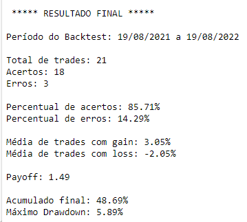
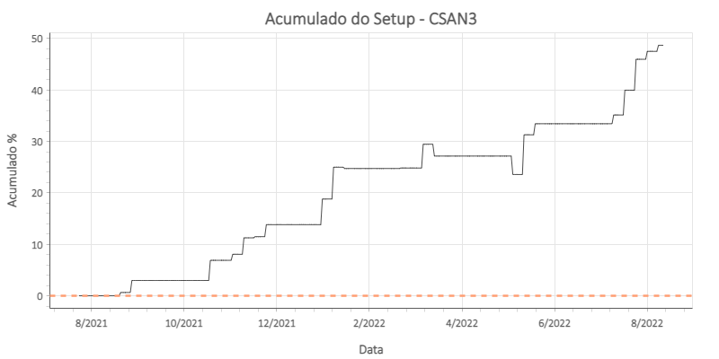

# Setup RSI 01

Esse setup é baseado em dois indicadores:

* RSI (Relative Strength Index) configurado para 6 períodos;
* Média móvel exponencial configurada para 9 períodos.

A estratégia ainda utiliza o dia da semana como outro parâmetro de entrada.

## Forma de entrada da operação

* RSI(6) precisa estar acima do nível 50;
* Fechamento precisa estar acima da EMA(9);
* É preciso estar em uma terça-feira.

## Forma de saída da operação

* A saída da operação é próximo ao fechamento do 2º dia após a entrada.

## Resultado Final

